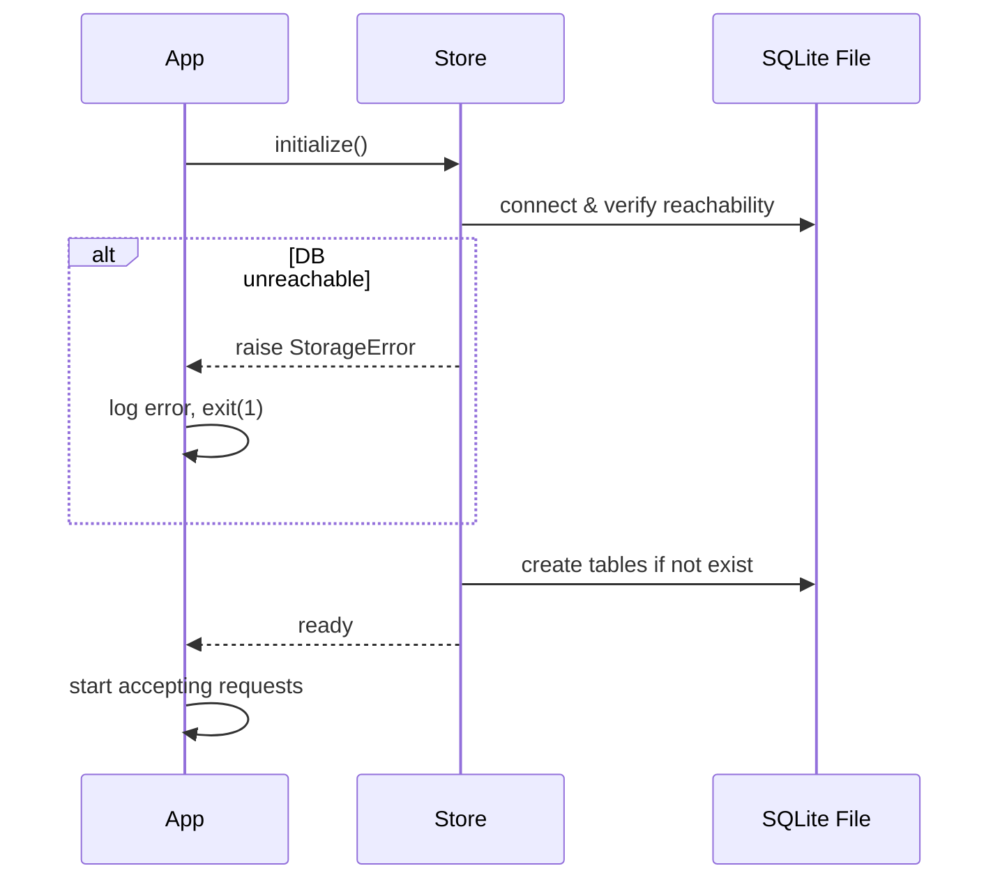

# Design Document: Python URL Shortener

## Overview

The Python URL Shortener is a lightweight HTTP API service that converts long URLs into short, shareable codes and redirects clients to the original destination. It exposes five endpoint groups: URL shortening, URL redirection, link statistics, custom short codes, expiration management, and a health check.

The service is built with **FastAPI** for its automatic OpenAPI generation, async request handling, and native Pydantic validation. URLs are stored in a **SQLite** database via **SQLAlchemy** (async), providing durable persistence across restarts without requiring an external database server. This makes the service easy to deploy as a single process.

### Key Design Decisions

| Decision | Choice | Rationale |
|---|---|---|
| Web framework | FastAPI | Async, fast, built-in validation and docs |
| Storage | SQLite + SQLAlchemy (async) | File-based durability, zero infrastructure |
| Short code generation | `secrets.token_urlsafe` + base62 truncation | Cryptographically random, alphanumeric-safe |
| Redirect type | HTTP 302 | Temporary redirect; analytics-friendly (no client caching) |
| Expiration check | At request time | Simple, no background job needed |

---

## Architecture

The service follows a three-layer architecture:

```
┌─────────────────────────────────────────────┐
│              HTTP Layer (FastAPI)            │
│  /shorten  /{code}  /stats/{code}  /health  │
└──────────────────┬──────────────────────────┘
                   │
┌──────────────────▼──────────────────────────┐
│            Service / Business Logic         │
│   URLService  •  CodeGenerator              │
└──────────────────┬──────────────────────────┘
                   │
┌──────────────────▼──────────────────────────┐
│               Store Layer                   │
│   URLStore (SQLAlchemy async + SQLite)       │
└─────────────────────────────────────────────┘
```

### Startup Sequence



### Request Flow — POST /shorten

```mermaid
sequenceDiagram
    participant C as Client
    participant API
    participant SVC as URLService
    participant CG as CodeGenerator
    participant ST as Store

    C->>API: POST /shorten {url, custom_code?, expires_in?}
    API->>API: Pydantic validation
    API->>SVC: shorten(url, custom_code?, expires_in?)
    SVC->>ST: find_by_original_url(url)
    alt already exists (no custom code)
        ST-->>SVC: existing mapping
        SVC-->>API: existing short_url
    else new mapping
        alt custom code provided
            SVC->>ST: find_by_short_code(custom_code)
            alt code taken
                ST-->>SVC: mapping exists
                SVC-->>API: 409 Conflict
            end
        else generate code
            loop up to 10 attempts
                CG->>CG: generate candidate
                SVC->>ST: find_by_short_code(candidate)
                alt unique
                    break
                end
            end
        end
        SVC->>ST: create_mapping(...)
        ST-->>SVC: saved mapping
        SVC-->>API: short_url
    end
    API-->>C: 200 {short_url, ...}
```

---

## Components and Interfaces

### 1. API Layer (`app/api/`)

Thin FastAPI routers that handle HTTP concerns only: request parsing, response serialization, and mapping service exceptions to HTTP status codes.

**Routers:**

| Module | Endpoints |
|---|---|
| `routers/shorten.py` | `POST /shorten` |
| `routers/redirect.py` | `GET /{short_code}` |
| `routers/stats.py` | `GET /stats/{short_code}` |
| `routers/health.py` | `GET /health` |

**Exception → HTTP mapping:**

| Exception | HTTP Status |
|---|---|
| `ValidationError` (Pydantic) | 422 |
| `NotFoundError` | 404 |
| `ConflictError` | 409 |
| `ExpiredError` | 410 |
| `StorageError` | 503 |
| `CodeGenerationError` | 500 |
| `StorageWriteError` | 500 |

### 2. Service Layer (`app/services/`)

Contains all business logic. Stateless; depends on `URLStore` injected via FastAPI dependency injection.

```python
class URLService:
    def __init__(self, store: URLStore, code_generator: CodeGenerator, base_url: str): ...

    async def shorten(
        self,
        original_url: str,
        custom_code: str | None = None,
        expires_in: int | None = None,
    ) -> Mapping: ...

    async def redirect(self, short_code: str) -> Mapping: ...

    async def get_stats(self, short_code: str) -> Mapping: ...
```

### 3. Code Generator (`app/services/code_generator.py`)

```python
class CodeGenerator:
    ALPHABET = string.ascii_letters + string.digits  # A-Z a-z 0-9

    def generate(self, length: int = 8) -> str:
        """Returns a random alphanumeric string of the given length (6-12)."""
        return "".join(secrets.choice(self.ALPHABET) for _ in range(length))
```

- Uses `secrets.choice` for cryptographic randomness.
- Default length is 8, well within the 6–12 range.
- Caller (`URLService`) retries up to 10 times on collision.

### 4. Store Layer (`app/store/`)

```python
class URLStore:
    async def initialize(self) -> None: ...
    async def find_by_original_url(self, original_url: str) -> Mapping | None: ...
    async def find_by_short_code(self, short_code: str) -> Mapping | None: ...
    async def create_mapping(self, mapping: Mapping) -> Mapping: ...
    async def increment_access_count(self, short_code: str) -> None: ...
    async def health_probe(self, timeout: float = 1.0) -> bool: ...
```

- `initialize()` is called at startup; raises `StorageError` if the DB is unreachable.
- `increment_access_count` is fire-and-forget for the redirect path (failure is logged but does not block the 302 response per Requirement 2.5).
- `health_probe` runs a lightweight `SELECT 1` within the given timeout.

### 5. Pydantic Schemas (`app/schemas/`)

```python
class ShortenRequest(BaseModel):
    url: AnyHttpUrl
    custom_code: str | None = None
    expires_in: int | None = None  # seconds

class ShortenResponse(BaseModel):
    short_url: str
    short_code: str
    original_url: str
    expires_at: datetime | None = None

class StatsResponse(BaseModel):
    short_code: str
    original_url: str
    created_at: datetime      # ISO 8601
    access_count: int
    expires_at: datetime | None = None

class HealthResponse(BaseModel):
    status: Literal["operational", "degraded"]
    store: Literal["reachable", "unreachable"]
```

---

## Data Models

### Database Schema (SQLite)

```sql
CREATE TABLE url_mappings (
    short_code   TEXT PRIMARY KEY,
    original_url TEXT NOT NULL,
    created_at   TEXT NOT NULL,   -- ISO 8601 UTC
    access_count INTEGER NOT NULL DEFAULT 0,
    expires_at   TEXT             -- ISO 8601 UTC, NULL means no expiry
);

CREATE INDEX idx_original_url ON url_mappings(original_url);
```

- `short_code` is the primary key — lookups by code are O(1).
- `original_url` is indexed to support deduplication on `POST /shorten`.
- `expires_at` is stored as ISO 8601 text; expiry is checked in Python at request time.
- `access_count` is updated with `UPDATE … SET access_count = access_count + 1` to be atomic within SQLite's serialized writer.

### Python Domain Model

```python
from dataclasses import dataclass
from datetime import datetime

@dataclass
class Mapping:
    short_code: str
    original_url: str
    created_at: datetime
    access_count: int = 0
    expires_at: datetime | None = None

    def is_expired(self) -> bool:
        if self.expires_at is None:
            return False
        return datetime.utcnow() > self.expires_at
```

### Validation Rules

| Field | Rule |
|---|---|
| `original_url` | Must have `http` or `https` scheme and a well-formed host (Pydantic `AnyHttpUrl`) |
| Auto-generated `short_code` | Alphanumeric only, length 6–12 |
| Custom `short_code` | Alphanumeric + hyphens, length 3–50 |
| `expires_in` | Positive integer, ≤ 315,576,000 seconds |

---

## Correctness Properties

*A property is a characteristic or behavior that should hold true across all valid executions of a system - essentially, a formal statement about what the system should do. Properties serve as the bridge between human-readable specifications and machine-verifiable correctness guarantees.*

### Property 1: Short code generation correctness

*For any* original URL shortened by the service without a custom code, the auto-generated short code SHALL consist solely of alphanumeric characters (A-Z, a-z, 0-9) with a length between 6 and 12 characters inclusive, and the returned short_url SHALL equal the service base URL concatenated with "/" and that short code.

**Validates: Requirements 1.5, 1.7**

---

### Property 2: Shortening idempotence

*For any* valid original URL that has already been shortened (without a custom code), submitting it again to POST /shorten SHALL return the same short code as the first submission - no new mapping is created.

**Validates: Requirements 1.2**

---

### Property 3: Redirect round-trip

*For any* original URL that has been successfully shortened to a short code, a GET /{short_code} request SHALL return an HTTP 302 response whose Location header is exactly the original URL.

**Validates: Requirements 2.1**

---

### Property 4: Access count monotonically increases

*For any* short code with a current access count N, after any number of redirect requests (1 to K) for that non-expired code, the access count recorded in the store SHALL equal N + K. The same count SHALL be reflected by GET /stats/{short_code}.

**Validates: Requirements 2.3, 4.3**

---

### Property 5: Persistence round-trip

*For any* mapping (short code, original URL, created_at, access_count, expires_at) written to the store, reading it back from the store SHALL return a mapping with field values identical to those written.

**Validates: Requirements 3.1, 3.4**

---

### Property 6: Expiration boundary

*For any* mapping whose expires_at timestamp is strictly in the past (current UTC time > expires_at), a GET /{short_code} request SHALL return HTTP 410, and the store SHALL NOT increment the access count - leaving it equal to its value before the request.

**Validates: Requirements 6.2, 6.5**

---

### Property 7: Stats completeness

*For any* existing short code (whether expired or not), the response from GET /stats/{short_code} SHALL return HTTP 200 and contain the short code, original URL, creation timestamp in ISO 8601 format, current access count, and - if set - the expiration timestamp.

**Validates: Requirements 4.1, 6.3**

---

### Property 8: Custom code conflict detection

*For any* short code already present in the store, submitting a POST /shorten request with that same custom code SHALL return HTTP 409 regardless of whether the original URL is the same or different.

**Validates: Requirements 5.3**

---

### Property 9: Custom code and expiration validation rejection

*For any* string that either (a) contains characters outside [A-Za-z0-9-], or (b) has a length outside 3-50 characters, submitting it as a custom short code SHALL return HTTP 422. Similarly, for any expires_in value that is zero, negative, non-integer, or greater than 315,576,000, the POST /shorten request SHALL return HTTP 422.

**Validates: Requirements 5.2, 5.4, 6.4**

---

### Property 10: Expiration timestamp recorded correctly

*For any* valid expires_in value (1 to 315,576,000 seconds), the expires_at field in the response SHALL be within one second of the creation timestamp plus expires_in, and the same value SHALL be readable from the store and returned by GET /stats/{short_code}.

**Validates: Requirements 6.1**

---
## Error Handling

### Exception Hierarchy

```
AppError (base)
├── ValidationError       → 422  (invalid URL, bad custom code, bad expires_in)
├── NotFoundError         → 404  (short code not in store)
├── ConflictError         → 409  (custom code already in use)
├── ExpiredError          → 410  (mapping exists but has expired)
├── StorageError          → 503  (store unreachable at read time)
├── StorageWriteError     → 500  (write to store failed)
└── CodeGenerationError   → 500  (failed to generate unique code after 10 attempts)
```

All errors are returned as JSON:

```json
{"detail": "<human-readable message>"}
```

### Specific Error Scenarios

| Scenario | HTTP | Logged? |
|---|---|---|
| Missing `url` field | 422 | No |
| Invalid URL scheme/host | 422 | No |
| Custom code invalid chars/length | 422 | No |
| `expires_in` not positive integer or > max | 422 | No |
| Short code not found | 404 | No |
| Custom code conflict | 409 | No |
| Link expired | 410 | No |
| Store unreachable (read) | 503 | Yes |
| Store write failure | 500 | Yes |
| Code generation exhausted | 500 | Yes |
| Health probe timeout | 503 | Yes |

### Redirect Access Count Failure

Per Requirement 2.5, if `increment_access_count` raises an exception after the redirect target has been determined, the service:

1. Logs the error (warning level) with the short code and exception details.
2. Returns the HTTP 302 response regardless.
3. Does **not** propagate the exception to the client.

---

## Testing Strategy

### Dual Testing Approach

Unit tests cover specific examples, edge cases, and error conditions. Property-based tests verify universal properties across a wide input space. Both layers are complementary and necessary for comprehensive correctness.

### Property-Based Testing

**Library:** [Hypothesis](https://hypothesis.readthedocs.io/) (Python)

Each property from the Correctness Properties section maps to exactly one Hypothesis test. Tests run a minimum of 100 examples per property.

Tag format in test comments:
```
# Feature: python-url-shortener, Property {N}: {property_text}
```

**Properties and test targets:**

| Property | Test file | What varies |
|---|---|---|
| 1 – Short code format invariant | `test_code_generator.py` | Input URL (any valid http/https URL) |
| 2 – Shortening idempotence | `test_url_service.py` | Valid URLs submitted multiple times |
| 3 – Redirect round-trip | `test_url_service.py` | Valid URLs → short code → redirect target |
| 4 – Access count monotonically increases | `test_url_service.py` | Number of successive redirect calls (1–50) |
| 5 – Persistence round-trip | `test_store.py` | Mapping field values (strings, timestamps, counts) |
| 6 – Expiration boundary | `test_url_service.py` | expires_at offsets (past vs future) |
| 7 – Stats completeness | `test_url_service.py` | Any short code, expired or not |
| 8 – Custom code conflict detection | `test_url_service.py` | Distinct original URLs sharing the same custom code |

**Hypothesis strategy notes:**
- Generate URLs using `st.from_regex(r'https?://[a-z0-9]+\.[a-z]{2,}/[^\s]*')` or a custom strategy.
- Generate alphanumeric short codes using `st.text(alphabet=string.ascii_letters + string.digits, min_size=6, max_size=12)`.
- Use `@settings(max_examples=100)` minimum on all property tests.

### Unit Tests

**Framework:** pytest + pytest-asyncio

Unit test categories:

- **Happy paths**: each endpoint returns the correct status code and body for valid inputs.
- **Validation edge cases**: empty string, URL with unsupported scheme (`ftp://`), whitespace-only custom code, `expires_in=0`, `expires_in=315576001`.
- **Error paths**: store raises `StorageError`, code generator exhausts attempts, duplicate original URL returns existing mapping.
- **Redirect count failure**: `increment_access_count` raises but 302 is still returned.
- **Health check**: probe succeeds (200 operational), probe times out (503 degraded).

**Mocking strategy**: `URLStore` is always mocked in unit tests using `unittest.mock.AsyncMock`. Property tests targeting `URLStore` (Property 5) use an in-memory SQLite instance (`sqlite:///:memory:`).

### Integration Tests

A small number of integration tests (3–5) run against a real SQLite file to verify end-to-end behaviour:

1. Create a mapping, restart the store, confirm the mapping is still resolvable.
2. Redirect increments the count visible in `/stats`.
3. Expired link returns 410.

### Test File Layout

```
tests/
├── unit/
│   ├── test_code_generator.py   # Property 1 + unit tests
│   ├── test_url_service.py      # Properties 2–4, 6–8 + unit tests
│   ├── test_store.py            # Property 5 + unit tests
│   └── test_api/
│       ├── test_shorten.py
│       ├── test_redirect.py
│       ├── test_stats.py
│       └── test_health.py
└── integration/
    └── test_persistence.py
```
